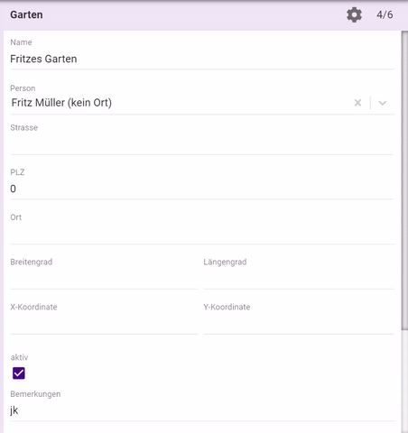

### Wieso

Nicht jeder erfasst dieselben Daten. Felder, die nicht verwendet werden, verringern die Übersicht, lenken ab und können verwirren. 
In vermehrung.ch gibt es daher eine Reihe von Feldern, die ausgeblendet werden können. 
Felder, welche für das Funktionieren der Anwendung wichtig sind, können nicht ausgeblendet werden.
  

### So geht's

Dafür wird das Zahnrad-Symbol oben rechts verwendet: 
 

### So funktioniert es

Es ist möglich, dass gewisse Felder nur in bestimmten Kulturen benutzt werden. Daher wirkt sich das Ein- und Ausblenden bei allem, was zu einer Kultur gehört, nur innerhalb dieser Kultur aus. Das sind:

- Kultur
- Teil-Kulturen
- Zählungen
- Events

Was nicht einer Kultur zugeordnet ist, wird pro Benutzer bestimmt. Das sind momentan:

- Herkünfte
- Gärten
- Lieferungen
