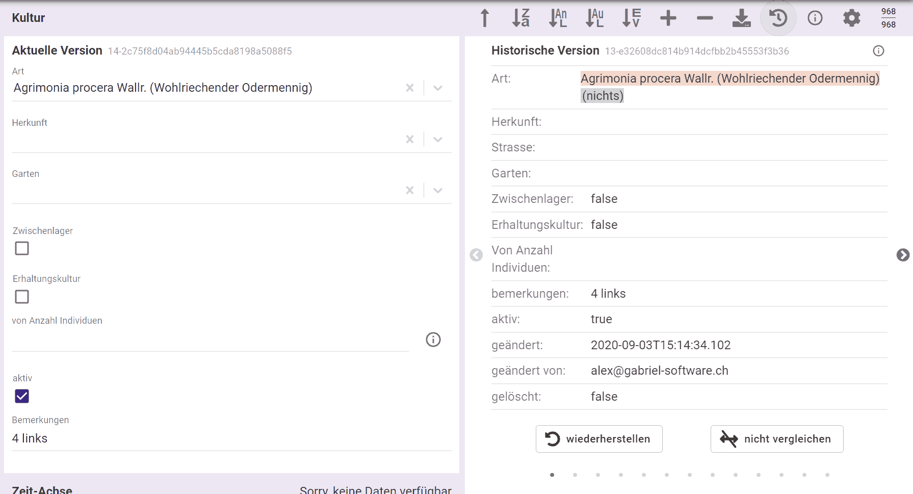

Die Historisierung zeigt alle bisherigen Versionen eines Datensatzes an. Und sie ermöglicht, jeden dieser Zustände wieder herzustellen.  

Um offline fähig zu sein ([mehr dazu](../offline-wie)) erstellt vermehrung.ch bei jeder Änderung eines Datensatzes eine neue Version. Somit **verfügt vermehrung.ch über eine vollständige Historisierung aller Datensätze**, beginnend seit deren Import im Sommer 2020. Aktuell (im Herbst 2020) gibt es bei den meisten Daten noch keine historischen Versionen, weil sie noch nicht innerhalb von vermehrung.ch bearbeitet wurden.  

Um die Historie eines Datensatzes zu sehen, klickt man auf das entsprechende Symbol: 

- In der Mobil-Ansicht gibt es statt des Symbols einen Menü-Eintrag
- Das Historie-Symbol ist inaktiv, wenn es keine historische Versionen gibt
- Es ist auch inaktiv, wenn man offline ist (historische Versionen sind nur online verfügbar)

Nun öffnet sich rechts der aktuellen Version eine neue Spalte. Sie stellt alle verfügbaren Versionen in einem "Karussell" dar: 
 

- Die letzte Version ist im Karussell sichtbar
- Unterschiede zur aktuellen Version werden farblich hervorgehoben (die "nicht vergleichen"-Schaltfläche schaltet diese Funktion aus)
- Mit den Pfeil-Symbolen, Pfeil-Tasten auf der Tastatur (nach Klick irgendwo ins Formular) oder Wischgesten kann man sich nun Version um Version durch die Historie bewegen
- Die Punkte zuunterst stellen je eine Version dar. Durch Klick auf einen Punkt navigiert man zur entsprechenden Version
- Klickt man auf die "wiederherstellen"-Schaltfläche, wird die aktuelle Version durch die historische ersetzt
- Die "i"-Schaltfläche rechts neben der Versions-Nummer führt zu dieser Dokumentations-Seite
