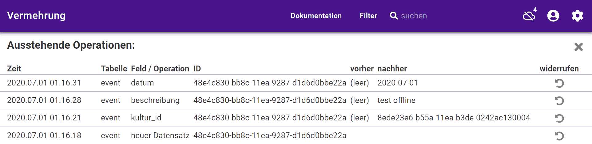

### Wieso

Nicht jeder Garten verfügt über WLAN. Nicht jedes Eingabegerät verfügt über mobiles Internet. Ausserdem gibt es räumliche und zeitliche Lücken in der Verfügbarkeit von mobilem Internet.  

Zumindest ist dies das Ziel. Aktuell sind die meisten dafür nötigen Anpassungen erfolgt. Ausgiebig getestet ist das noch nicht. Mit Fehlern und Nachbesserungen ist daher zu rechnen.  

### Verbindungs-Status

vermehrung zeigt die Verfügbarkeit des Internets an: 
 

Und auch dessen Fehlen: 
 

### Eine Schlange für Operationen

Arbeitet man offline, packt vermehrung jede Daten-Änderung in "Päckchen" (genannt: Operationen). Diese Päckchen warten geduldig. Das Offline-Symbol zeigt dann die Länge der Warteschlange an: 
 

Sobald vermehrung wieder online ist, werden die Päckchen dem Server geschickt: 
 

und dort verarbeitet.  

### Konflikte

Was macht der Server? Er sucht **Konflikte** und wählt **Sieger**.  

#### Konflikte finden

Gibt es widersprüchliche Versionen des gleichen Datensatzes, nennen wir dies einen Konflikt. 
Konflikte entstehen, wenn mehrere Personen gleichzeitig denselben Datensatz ändern. Oder: während jemand offline war. 
Konflikte können auch entstehen, wenn dieselbe Person vermehrung.ch auf mehreren Geräten (teilweise offline) benutzt.  

#### Sieger wählen

Der Server von vermehrung.ch wählt automatisch Sieger. Leider ist er nicht allwissend. Darum notiert er beim Sieger auch, welche widersprüchlichen Versionen es gibt. Das wird im Formular angezeigt:
 

  
Wollen Sie genauer wissen, [wie vermehrung.ch offline fähig wird](../offline-wie)?