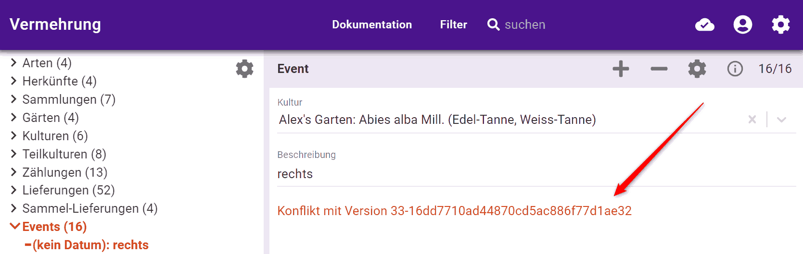

### Wieso?

Nicht jeder Garten verfügt über WLAN. Nicht jedes Eingabegerät verfügt über mobiles Internet. Zudem gibt es räumliche und manchmal zeitliche Lücken in der Verfügbarkeit von mobilem Internet.  

### Kann eine Web-App offline funktionieren?

Ja. Na ja - nicht auf iOS, [weil Apple Web-App's nicht genug Speicher geben will](../iOS).  

### Verbindungs-Status

vermehrung zeigt die Verfügbarkeit des Internets an: 
 

Und auch dessen Fehlen: 
 

Weil vermehrung alle Daten, die Sie lesen dürfen, voraus lädt und auf Ihrem Gerät speichert, müssen Sie nicht erschrecken, wenn Sie plötzlich offline sein sollten. Sie können einfach weiter arbeiten. Alles, was Sie brauchen, ist da 😎.  

### Schlange für Operationen

Arbeiten Sie offline, packt vermehrung jede Daten-Änderung in "Päckchen" (genannt: Operation). Diese Päckchen warten geduldig. Das offline-Symbol zeigt die Länge der Warteschlange an: 
 

Sobald vermehrung wieder online ist, werden die Päckchen dem Server geschickt... 
 

...und dort verarbeitet. Sobald die Zahl verschwunden ist, ist ihr Gerät mit dem Server synchronisiert.  

Sie können sich durch Klick auf das Online-Symbol auch die Schlange auflisten lassen:

...und wenn nötig Operationen widerrufen.  

### Konflikte

Was macht der Server mit Ihren Päckchen? Er speichert sie natürlich, wie jeder gute Server. Zusätzlich sucht er **Konflikte** und wählt **Sieger**.  

#### Konflikte finden

Gibt es widersprüchliche Versionen des gleichen Datensatzes, nennen wir dies einen Konflikt. 
Konflikte entstehen, wenn mehrere Personen gleichzeitig denselben Datensatz ändern. Oder während jemand offline war. 
Konflikte können auch entstehen, wenn dieselbe Person vermehrung.ch auf mehreren Geräten (teilweise offline) benutzt.  

#### Sieger wählen

Der Server von vermehrung.ch wählt automatisch Sieger. Leider ist er nicht allwissend. Darum notiert er beim Sieger auch, welche widersprüchlichen Versionen es gibt. Das wird im Formular angezeigt: 
 

Klickt man auf den Konflikt, öffnet sich das Formular mit der widersprüchlichen Version: 
 

Hier sehen Sie die Unterschiede. Sie haben drei Optionen:

1. widersprüchliche Version verwerfen
2. widersprüchliche Version übernehmen
3. aktuelle Version anpassen und danach die wiedersprüchliche verwerfen

Im Gegensatz zum Server sind sie hoffentlich allwissend genug, um den Konflikt abschliessend zu bereinigen 😁  

Es steckt mehr hinter der offline-Fähigkeit von vermehrung.ch. Neugierige [lesen hier weiter](../offline-wie).
