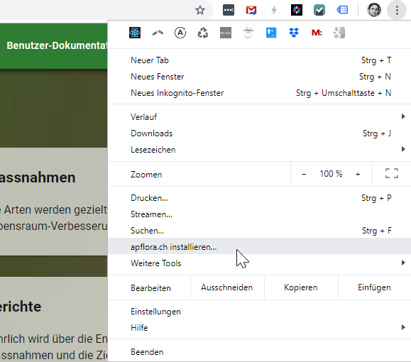

vermehrung.ch ist eine [**Progressive Web App**](https://developers.google.com/web/progressive-web-apps) (PWA).  

"Progressive Web Apps" sind Web-Apps und werden für Browser entwickelt. Weil sie einige zusätzliche Anforderungen erfüllen, können sie je länger je weniger von "normalen" Apps unterschieden werden. Das ist das erklärte Ziel von Google und Microsoft.  

**Was ist der Unterschied zu einer gewöhnlichen Webseite?**

- Sie können vermehrung auf Desktop/Startseite platzieren bzw. "installieren".
  - In Chrome auf PC und Mac öffnen Sie dazu das Menü ganz oben rechts:
    
    Ganz rechts in der URL-Zeile gibt es dafür ein +-Symbol.
  - Auf Android werden Sie von Chrome gefragt, ob sie vermehrung auf dem Startbildschirm platzieren wollen.
- Danach hat vermehrung eine eigene Verknüpfung und startet ausserhalb des Browsers in einem eigenen Fenster, ohne URL-Zeile.
- Auch vermehrung-Links sollen bald mit der installierten Version geöffnet werden (funktioniert bereits auf Android)
- Leider [funktioniert vermehrung.ch auf iOS (iPhone, iPad) nicht](/ios) 

**Was ist der Unterschied zu einer traditionellen Applikation?**

- Die App funktioniert auf allen Bertriebssystemen und auf allen Geräten mit modernem Browser
- Statt die App zu installieren, müssen Sie nur vermehrung.ch besuchen
- Updates erfolgen automatisch
- Einer neuen Mitarbeiterin schicken Sie einfach URL und Login. Schon kann sie loslegen!
