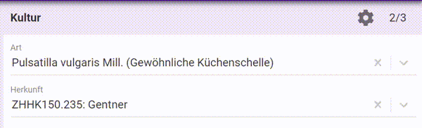

Grössere Gärten oder gärtnerische Betriebe organisieren ihre Kulturen oft in Untereinheiten, wie zum Beispiel: "Beete", "Kästen", "Reihen". 
In vermehrung.ch werden diese Untereinheiten "Teil-Kulturen" genannt.  

### 1. Ziele

- [Projekt-Ziel](/ziele) 3 und 4: "Anzahl Pflanzen und Anzahl auspflanz-bereite Pflanzen sind bekannt und können geplant werden", "Anzahl Mutterpflanzen ist bekannt." 
  In grossen Kulturen erleichtert eine Unterteilung die Erfassung der Anzahlen
- [Projekt-Ziel](/ziele) 6: "Effiziente und quell-nahe Erfassung und Nutzung." 
  In kleinen Kulturen würden Teil-Kulturen bloss ablenken. Darum sind Teil-Kulturen "opt-in", das heisst sie erscheinen erst, wenn man sie will (siehe unten)
- [Projekt-Ziel](/ziele) 8: "In grossen Gärten haben MitarbeiterInnen die Übersicht über die (räumliche) Organisation der Kulturen." 
  Bei der Kultur kann ein Teilkultur-Plan als Datei angefügt werden. Teil-Kulturen sind so aufgebaut, dass künftig bei Bedarf auch Geometrien erfasst werden könnten.

### 2. Umsetzung

Bei Kulturen gibt es die Option "Mit Teil-Kulturen arbeiten". 
 
Sie ermöglicht:
  

#### Es können Teil-Kulturen erfasst werden

Neben der zugehörigen Kultur wird vorerst nur ein Name erfasst. "Name" ist eine simple Methode, damit verschiedene Systeme, Untereinheiten zu bilden möglich sind, ohne dass vermehrung.ch eines vorgeben muss.  

Beispiel: Ein Betrieb hat Beete, darin Kästen und darin Reihen. Es soll pro Reihe gezählt werden. Von jeder Kategorie gibt es nie mehr als 99. 
In diesem Fall empfiehlt es sich, für den Namen diese drei Hierarchiestufen so oder ähnlich zu kombinieren: "02/03/12". Das ist Reihe 12 im Kasten 3 im Beet 2. Auf diese Weise sortieren sich die Namen auch wie erwartet.  

Um Teil-Kulturen erfassen zu können, erscheint im Navigations-Baum unter der Kultur ein neuer Ast. Eine neue Teil-Kultur kann aber auch direkt im Feld, in dem man Teil-Kulturen auswählt, erfasst werden: Einfach den neuen Wert tippen und "... als neue Teilkultur aufnehmen" wählen. 

  

#### Zählungen können pro Teil-Kultur erfasst werden

Pro Kultur können (fakultativ) mehrere Teil-Zählungen erfasst werden. Die Teil-Zählungen können einer Teil-Kultur zugeordnet werden. 
vermehrung.ch summiert alle Zahlen der Einheiten "Anzahl Pflanzen", "anzahl auspflanz-bereit" und "Anzahl Mutter-Pflanzen" pro Kultur.
  

#### Events können Teil-Kulturen zugeordnet werden

...müssen aber nicht.
  

#### Kulturen können individuell organisiert werden

Die Option "Teil-Kulturen" wirkt pro Kultur. Man kann daher in jeder Kultur wählen, ob Teil-Kulturen erfasst werden können und nach welchem System.
  

#### Teilkulturen können in drei Stufen zusätzlich beschrieben werden

...wozu die Felder "ort1", "ort2" und "ort3" dienen.
